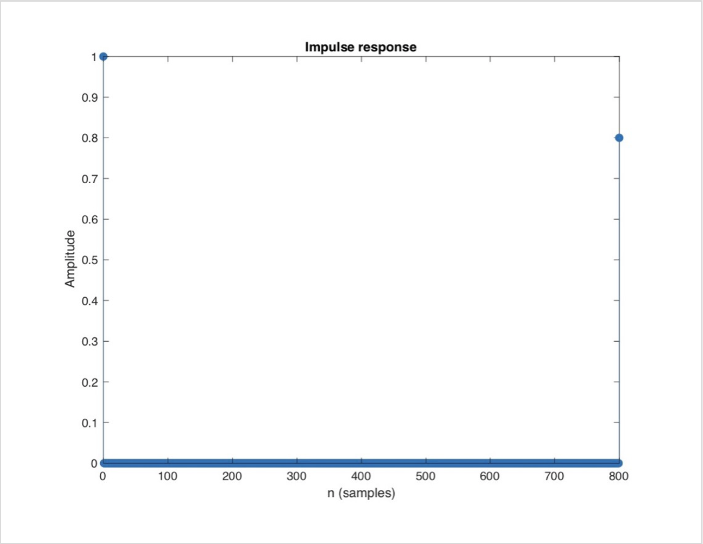
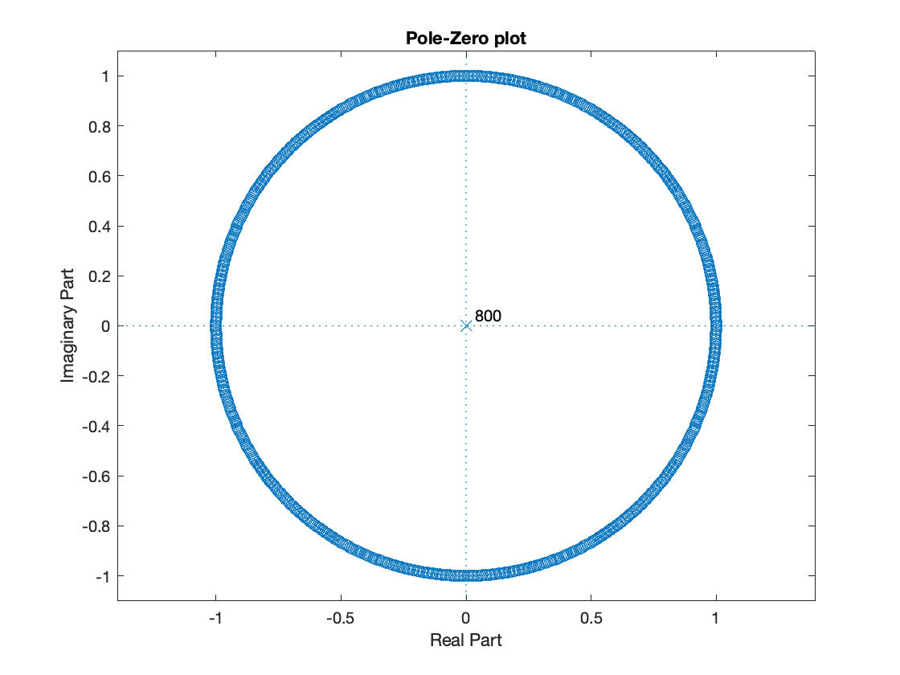

# demo 08

**Name:** Sagar Patel

**NETID:** sp5894

---

## Question 01
For the filter implemented in the demo program, what is the difference equation, transfer function, and impulse response? Use Matlab to plot the pole-zero diagram of the filter.

**Answer:**

We have,

$G = 0.8, b_0 = 1$

$Rate = 16000$

$delay = 0.05$

Now, we know that --

$N = \text{Rate} \times \text{delay} = 16000 \times 0.05 = 800$

$y(n) = b_{0}.x(n) + G.x(n-N)$

$\Rightarrow y(n) = x(n) + 0.8 x(n - 800)$

After performing Z-transformation,

$Y(Z) = X(Z) [1 + 0.8 Z^{-800} ]$

$\therefore H(Z) = \frac{Y(Z)}{X(Z)} = 1 + 0.8 Z^{-800}$

This is the difference equation and the transfer function.

**MATLAB Code Implementation:**

N= 800;

b=[1 zeros(1,N-1) 0.8];

a=[1 0];

figure(1);

zplane(b,a);

title('Pole-Zero plot');