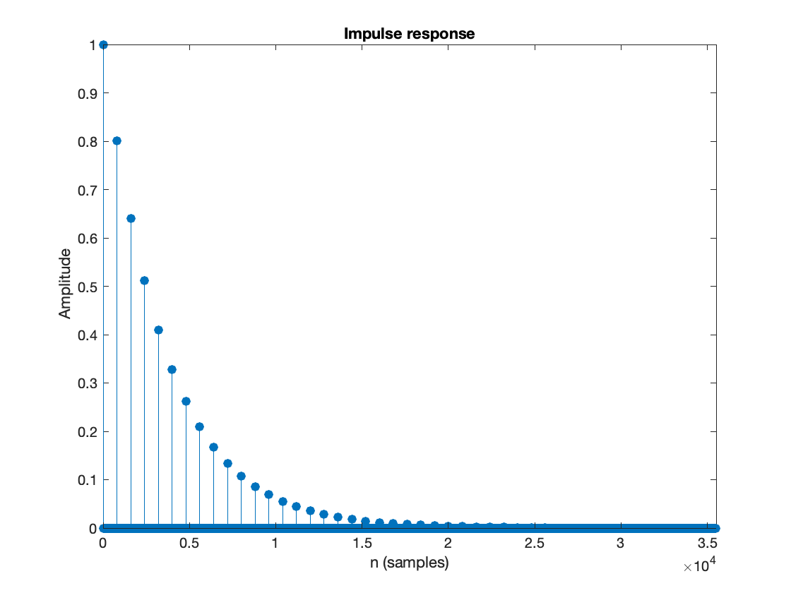

# demo 08

**Name:** Sagar Patel

**NETID:** sp5894

---

## Question 07:
In the demo program echo_via_circular_buffer.py, change the line buffer[k] = x0 to buffer[k] = y0 and comment on how this affects the sound of the output. With this change, what is the difference equation, transfer function, and impulse response of the system?

What happens when the gain for the delayed value is greater than 1?

**Answer:**

**Difference Equation and Transfer Function**

Given, 

$G = 0.8, b_0 = 1, N = 800$

$y(n) = b_{0}.x(n) + G.y(n - N)$

Substituting the values of $G$, $b_0$ and $N$,

$\Rightarrow y(n) = x(n) + 0.8y(n - 800)$

Taking Z-transformation, we get -

$\Rightarrow Y(Z) = X(Z) + 0.8 Z^{-800} Y(Z)$

$\therefore H(Z) = \frac{1}{1 - 0.8 Z^{-800}}$

**Observations**

1. Upon changing the value of $buffer[k]$ to $y_0$, the result of the filter is fed as the echo. This leads to a more distant echo as compared to using the input as the buffer.
2. When the gain for the delayed value is greater than 1, the echo gets louder than the original input and the resulting wave is entirely distorted.

**Impulse Response**

